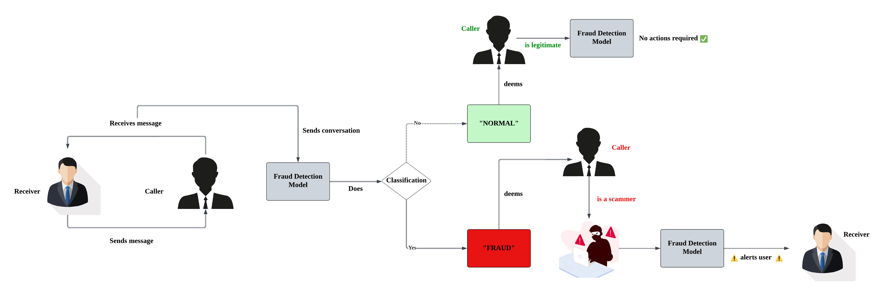

# ConvoShield

ConvoShield is a real-time conversation fraud detection system designed to enhance security on chat platforms like WhatsApp and Telegram. By leveraging a fine-tuned BERT model, it analyzes messages as they arrive, detecting subtle cues of scam attempts—such as manipulation, urgency, and scripted dialogues. It provides immediate alerts to users upon identifying fraudulent activity, helping prevent scams before they escalate.

ConvoShield is particularly effective in protecting vulnerable populations, such as the elderly, and offers a scalable, lightweight solution adaptable to various messaging platforms.

---

## 🚀 Project Highlights

- 🔍 **Real-Time Detection**: Classifies chat messages as "NORMAL" or "FRAUD" instantly.
- 🧠 **Fine-Tuned BERT Model**: Uses a reduced-layer BERT for efficiency and effectiveness in limited data scenarios.
- 📉 **High Accuracy**: Achieved 99.96% validation accuracy with stable generalization performance.
- 📊 **Cross-Validation & Optimization**: Applied k-fold cross-validation, learning rate scheduling, early stopping, and checkpointing.
- 🧪 **Compared with GPT Neo**: BERT outperformed GPT Neo in stability and generalization despite similar accuracy.
- ⚠️ **Fraud Alerts**: Immediately notifies users upon detecting fraudulent messages.
- 🔒 **Scalable & Adaptable**: Designed for deployment across various chat platforms with minimal computational overhead.

---

## 🧭 High-Level Workflow

Below is a simplified flow diagram showing how ConvoShield processes incoming chat messages:

1. A user receives a message via a chat platform (e.g., WhatsApp or Telegram).
2. The message is forwarded to the **fraud detection model**.
3. The model classifies the message as:
   - **NORMAL**: No further action needed.
   - **FRAUD**: An alert is triggered to warn the user.
4. The system continues monitoring the conversation in real time.

---

## 🧬 Model Architecture (BERT)

- Tokenization using **WordPiece**: Breaks text into subwords and adds special tokens like `[CLS]` and `[SEP]`.
- Embeddings:
  - **Word embeddings**: Capture the meaning of tokens.
  - **Positional embeddings**: Encode word order.
  - **Token type embeddings**: Differentiate between sequences.
- **6-Layer BERT Encoder**:
  - Reduced from 12 layers to handle small datasets and reduce overfitting.
  - Applies self-attention and feed-forward layers with **GELU activation**, **layer normalization**, and **dropout**.
- Classification:
  - Uses the pooled `[CLS]` representation.
  - Passes through a linear classifier and **sigmoid activation** for binary classification.
  - Threshold-based output: ≥0.5 → FRAUD, <0.5 → NORMAL.

---

## 📈 Evaluation & Results

| Model     | Avg. Validation Accuracy | Validation Loss Stability | Generalization |
|-----------|--------------------------|---------------------------|----------------|
| **BERT**  | 99.96%                   | Low Variability           | Strong         |
| GPT Neo   | 99.87%                   | High Fluctuations         | Weaker         |

BERT demonstrated stronger generalization across data splits, making it more reliable for real-world fraud detection scenarios.

---

## 🧩 Challenges

- **Data Scarcity**: Lack of publicly available conversation-level fraud datasets.
- **Overfitting Risk**: Small datasets required reduced model size and regularization.
- **Diverse Fraud Tactics**: Scam patterns vary widely, requiring flexible and context-aware models.

---

## 🔮 Future Work

- Expand the dataset to include more varied and real-world scam conversations.
- Implement **regularization** and **data augmentation** techniques to improve robustness.
- Explore **multi-modal fraud detection** (e.g., combining text with voice or metadata).

---